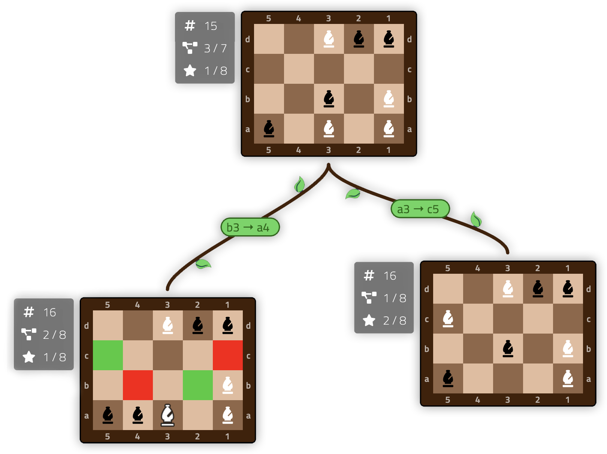

# TreeClimber
A visual tool for exploring decision trees in turned-based puzzles & games. _TreeClimber_ lets curious players try out all the possible "what-ifs," then learn from the graph they create! (This project may  be especially useful for CS students studying algorithms.)

Currently, the only content available is <a href="https://www.chessvariants.com/solitaire.dir/bishops.html">The Bishops Puzzle</a>, originally imagined by H. E. Dudeney in 1917, but popularized in the 1993 computer game _The Seventh Guest_. A single player attempts to swap the positions of the black & white bishops on a chess board, without moving any piece into a vulnerable square.

Future work may include similar chess puzzles (eg _The N-Queens Problem_, _Chess Contradance_) or even sliding block puzzles (à la _Rush Hour_).

## Trying it out

Most features should be usable on both desktop & mobile devices. The easiest way to play is to visit https://elanabellbogdan.com/tree-climber, where it's hosted publicly!

If you want to run it yourself instead...

### Building locally
1. Install <a href="https://yarnpkg.com/">yarn</a> (or npm)
2. From the project directory, run `yarn install`
3. Then run `yarn start` and wait for the build to complete
4. Finally, pointer your browser at `localhost:9000`

(You can also run `yarn build` to update `index.html` and the files in the `dist` directory.)

## Tech

_TreeClimber_ is largely written in vanilla JS, with some assistance from jQuery and Handlebars. The project is built using webpack, which converts the Less files to CSS and bundles everything all up together.